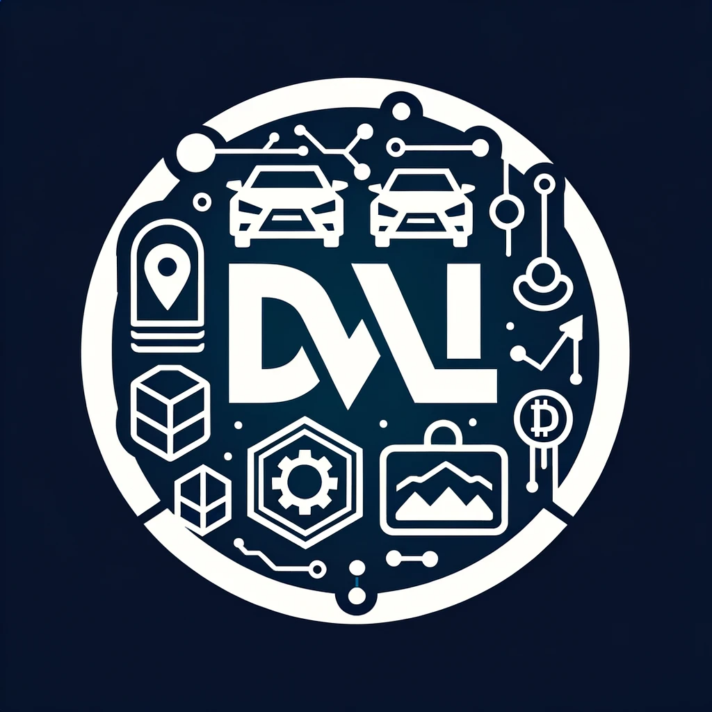

<div align="center">
  <a href="https://digitalvehiclelicense.netlify.app/">
    
  </a>

<h3 align="center">Digital Vehicle License</h3>

  <p align="center">
    Blockchain Project for Storing Vehicle Data 
    <br />
    <br />
    <a href="https://digitalvehiclelicense.netlify.app/">View Demo</a>
  </p>
</div>

## About The Project

![Product Name Screen Shot][product-screenshot]

Digital Vehicle Licence is a project that aims to revolutionise the way vehicle records are managed and accessed. Using blockchain technology, it enables secure, transparent and unalterable record keeping. Features include accident records, maintenance and inspection records, past ownership details, and tracking the condition of vehicle parts.

### Problem

The management of vehicle registrations today presents multiple challenges. Existing systems can often be disorganised, insecure and open to manipulation. This leads to a lack of transparency and trust in processes such as vehicle buying and selling, maintenance and repair services. Especially in the used car market, it is difficult to obtain accurate and reliable information about the vehicle's history. These deficiencies create the following main problems:

1. Reliability of Records: In current systems, the accuracy and reliability of vehicle history records are frequently questioned.
2. Data Manipulation: Physical documents and centralised databases are vulnerable to information changes and manipulation.
3. Access and Distribution Issues: Access and sharing of vehicle information can be complex and time-consuming.
4. Lack of Transparency: There is a lack of transparency in important information such as vehicle ownership history, accident records and maintenance history.

These problems negatively affect various parties such as vehicle owners, buyers, sellers, insurance companies and service providers. The Digital Vehicle Licence project aims to solve these problems by using blockchain technology to provide a reliable, transparent and unalterable registration system for all interested parties.

### Solution

The Digital Vehicle Licence project offers an innovative solution to existing problems in vehicle registration management. By utilising blockchain technology, this project provides secure, transparent and unalterable storage of vehicle registrations. This solution is characterised by the following features:

1. Security and Immutability: Blockchain technology guarantees the security and immutability of the records. Thus, the risk of data being manipulated or lost is minimised.
2. Transparency and Reliability: Important data such as vehicle history, accident records and maintenance information are recorded on the blockchain. This ensures that everyone can reliably access this information whenever they need it.
3. Decentralised Structure: By offering a decentralised structure, errors and manipulation from a single point are prevented.
4. Easy Access and Use: Through the web interface, users can easily access and manage vehicle records.
5. Smart Contracts: Smart contracts are used for automated and reliable transactions, which simplifies and accelerates the vehicle buying and selling process.

This solution offers a more transparent, reliable and effective vehicle registration management system for various parties such as vehicle owners, buyers, sellers, insurance companies and service providers. By modernising traditional vehicle registration processes, Digital Vehicle Licence aims to provide a better experience for all users.

### Model

![Model][model]

## Built With

- [![React][React-js]][React-url]
- [![Solidity][Solidity-img]][Solidity-url]
- [![Truffle][Truffle-img]][Truffle-url]
- [![Ganache][Ganache-img]][Ganache-url]
- [![Web3][Web3-img]][Web3-url]
- [![Metamask][Metamask-img]][Metamask-url]

## Getting Started

To get a local copy up and running follow these simple steps.

### Installation

1. Clone the repo
   ```sh
   git clone https://github.com/akkologlu/DigitalVehicleLicense
   ```
2. Install NPM packages to contract folder and frontend folder separately
   ```sh
   npm install
   ```
3. Run the app in the frontend/src folder

   ```sh
   npm start
   ```

4. For contract deployment, first change MNEMONIC and TEST_URL in deploy.js and run the following commands in the contract folder
   ```sh
   node compile.js
   node deploy.js
   ```

### Usage

1. Create a new account in Metamask.
2. Add Metamask extension to your browser.
3. Run the app in the frontend/src folder
   ```sh
   npm start
   ```
4. Connect Metamask to the project.
5. You can now use the app.

## Contributing

Contributions are what make the open source community such an amazing place to be learn, inspire, and create. Any contributions you make are **greatly appreciated**.

- Fork the Project.
- Create your Feature Branch (`git checkout -b feature/AmazingFeature`).
- Commit your Changes (`git commit -m 'Add some AmazingFeature'`).
- Push to the Branch (`git push origin feature/AmazingFeature`).
- Open a Pull Request.

## Contanct

- Abdullah AKKOLOĞLU

[![LinkedIn][LinkedIn-img]][LinkedIn-url]
[![Medium][Medium-img]][Medium-url]
[![X][X-img]][X-url]

[product-screenshot]: images/mainScreenshot.png
[model]: images/model.png
[React-js]: https://img.shields.io/badge/React-20232A?style=for-the-badge&logo=react&
[React-url]: https://reactjs.org/
[Solidity-img]: https://img.shields.io/badge/Solidity-%23363636.svg?style=for-the-badge&logo=solidity&logoColor=white
[Solidity-url]: https://docs.soliditylang.org/en/v0.8.6/
[Truffle-img]: https://img.shields.io/badge/Truffle-%23E2761B.svg?style=for-the-badge&logo=truffle&logoColor=white
[Truffle-url]: https://www.trufflesuite.com/
[Ganache-img]: https://img.shields.io/badge/Ganache-%231E1E1E.svg?style=for-the-badge&logo=ganache&logoColor=white
[Ganache-url]: https://www.trufflesuite.com/ganache
[Web3-img]: https://img.shields.io/badge/web3.js-F16822?style=for-the-badge&logo=web3.js&logoColor=white
[Web3-url]: https://web3js.readthedocs.io/en/v1.3.4/
[Metamask-img]: https://img.shields.io/badge/MetaMask-%23E2761B.svg?style=for-the-badge&logo=metamask&logoColor=white
[Metamask-url]: https://metamask.io/
[X-img]: https://img.shields.io/badge/X-%23000000.svg?style=for-the-badge&logo=X&logoColor=white
[X-url]: https://X.com/akkologluu
[LinkedIn-img]: https://img.shields.io/badge/linkedin-%230077B5.svg?style=for-the-badge&logo=linkedin&logoColor=white
[LinkedIn-url]: https://linkedin.com/in/akkologlu
[Medium-img]: https://img.shields.io/badge/Medium-12100E?style=for-the-badge&logo=medium&logoColor=white
[Medium-url]: https://medium.com/@akkologlu
